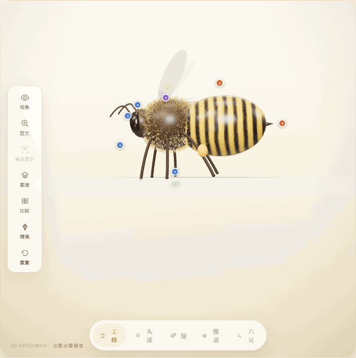
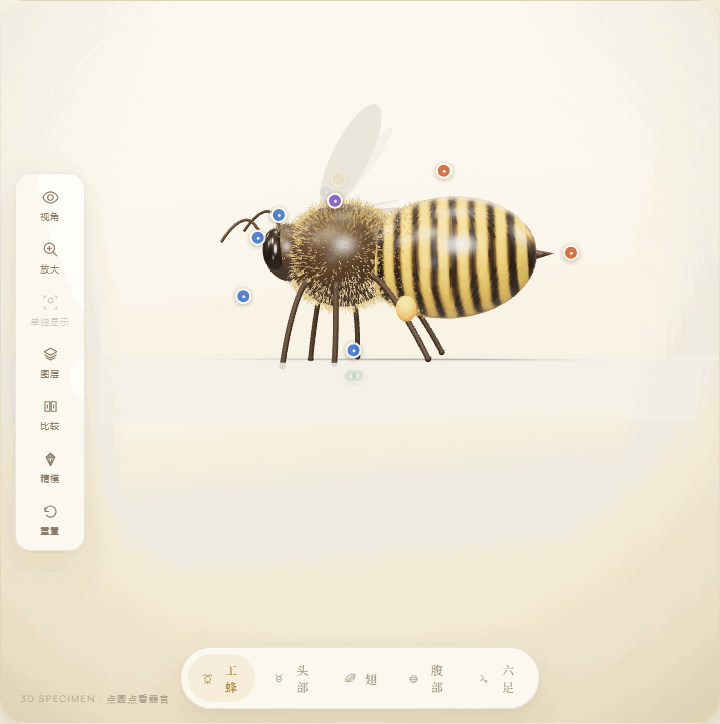
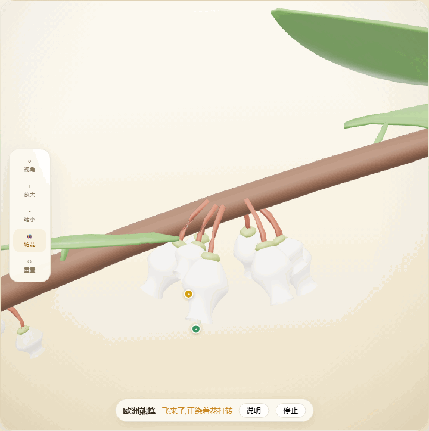
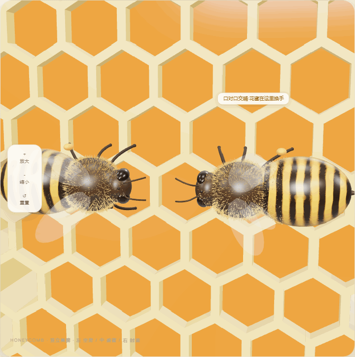

# 蜂之境（Bee Museum）

一个以蜜蜂为主角的沉浸式线上科普博物馆原型。

项目采用纯前端架构，通过 Three.js 与 React Three Fiber 在浏览器中生成和展示蜜蜂、花朵及相关生态过程。产品视觉方向为“高级艺术化写实”，建模策略为“程序化 3D 为主、重点 GLB/PBR 精模为辅”。

## 功能速览

**标本工作台** —— 旋转端详数字标本,点热点圆点逐器官讲解,底部一键切观察部位:



**精致标本模式** —— 东方蜜蜂三职型另备高保真精模,工具栏一键切换鉴赏:



**访花演示** —— 花朵馆里点一只蜂,看它绕花盘旋、落上倒挂的蓝莓花取蜜(每条蜂×花关系都有文献来源):



**蜂蜜工坊** —— 一滴花蜜的旅程六站演示:两只蜂口对口交哺、扇翅通风、封盖渐成,转化站还有分子视角小窗:



## 最新规划

- [整体开发方案](./bee-product-master-plan.md)：产品定位、六大展厅、首期展品、程序化建模思路、MVP 与里程碑。
- [前端技术方案](./bee-frontend-tech-stack.md)：目标架构、展品协议、目录、数据、性能、测试与实施顺序。
- [高级艺术化写实方向](./docs/advanced-stylized-realism-direction.md)：视觉和材质方向。
- [蜜蜂 3D 模型评估](./docs/bee-3d-model-evaluation.md)：现有模型与实现评估。

`bee-website-prd.md` 与 `bee-website-prd-v0.2.md` 为历史方案，不再作为当前版本的开发依据。

## 当前产品范围

博物馆计划包含：

- 世界不同地区和类型的多种蜜蜂数字标本。
- 西方蜜蜂、东方蜜蜂等社会性蜂类的工蜂、蜂王和雄蜂比较。
- 不同地域、季节与蜜蜂访花关系。
- 从卵、幼虫、蛹到成虫及死亡的生命历程。
- 从访花采蜜到蜂蜜成熟封盖的互动过程，以及蜂王浆的独立科普。
- 图鉴、器官热点、比较台、来源页和课堂展示模式。

首期不建设后端、用户账号、电商、多人联机或开放世界。

## 当前技术栈

- Vite
- React
- TypeScript
- Three.js
- React Three Fiber
- Drei

后续依赖会按里程碑引入，详见前端技术方案，不预先堆叠全部工具。

## 本地运行

```bash
npm install
npm run dev
```

类型检查与生产构建：

```bash
npm run typecheck
npm run build
```

## 当前开发进度

M0–M6 全部完成,五馆开放,收官状态见 [docs/LAUNCH-CHECKLIST.md](./docs/LAUNCH-CHECKLIST.md):

- **标本工作台**:6 种蜂 / 8 件数字标本(西方、东方蜜蜂各三职型),器官热点、图层、三职型比较台、引导讲解;东方蜜蜂另有三职型高保真精模鉴赏模式(`?hd=1`)。
- **花朵与四季馆**:7 种蜜源花的参数化模型、3 个地域的春夏花期、有来源的蜂花关系与访花演示(蜂落到花上,花粉筐彩蛋)。
- **生命历程馆**:工蜂一生(0–63 天)与壁蜂周年(12 个月)两条可拖动时间轴。
- **蜂蜜工坊**:一滴花蜜的旅程六站(蜂摆位演示、巢房叙事动画、分子视角小窗)、7 种单花蜜与 2 张纠偏卡。
- **内容与质量**:182 条展出内容全部通过三视角 AI 对抗式审查并逐条挂来源(见站内来源页);42 张视觉基线 + 11 条路由冒烟;发布门禁阻断任何草稿内容。


## 原创与致谢

**本项目原创:**

- 全部三维模型:6 种蜂的程序化标本(`beemodel/bee_gen`)、7 种花(`flowermodel/`)、蜂巢巢脾(`hivemodel/`)、东方蜜蜂三职型精模(`beemodel/*-standalone/`)——均在 Blender 中从零建模,**未使用任何外部模型、扫描数据、照片贴图或 AI 生成图像**;
- 全部站点代码、交互设计与"纸面标本"视觉风格;
- 全部中文科普文案(AI 起草、三视角对抗式审查,流程见 `content-review/`)。

**开源依赖(在此致谢):**

| 用途 | 项目 | 许可证 |
|---|---|---|
| UI 框架 | [React](https://react.dev)、[React Router](https://reactrouter.com) | MIT |
| 三维渲染 | [Three.js](https://threejs.org)、[React Three Fiber](https://github.com/pmndrs/react-three-fiber)、[drei](https://github.com/pmndrs/drei) | MIT |
| 数据校验 | [Zod](https://zod.dev) | MIT |
| 构建 | [Vite](https://vite.dev)、TypeScript | MIT / Apache-2.0 |
| 模型压缩 | [glTF-Transform](https://gltf-transform.dev)、[meshoptimizer](https://github.com/zeux/meshoptimizer) | MIT |
| 测试 | [Playwright](https://playwright.dev)、[Vitest](https://vitest.dev) | Apache-2.0 / MIT |
| 字体 | Noto Serif SC(与思源宋体同源)、Manrope(经 [Fontsource](https://fontsource.org) 自托管) | SIL OFL 1.1 |

**资料来源:**全部科普事实参考公开来源(维基百科、机构资料、学术论文)独立改写,未复制原文;98 条来源逐条列于站内"来源与审校"页,每条展出内容注明出处与审校状态。

**参照与启发(在此一并致谢):**

- **交互逻辑**参考了 [Anatomy](https://github.com/thebuggeddev/anatomy)(thebuggeddev,基于 Three.js 的交互式 3D 人体解剖浏览器)——本站"三维标本 + 器官热点 + 档案讲解"的观察范式受其启发;
- **建模路线**受 [insect-world](https://github.com/xr843/insect-world)(xr843,MIT——用 TypeScript + Three.js 在浏览器内参数化生成 63 种昆虫几何的交互图鉴)启发:本项目中途曾因模型来源停滞,尝试开源 Blender 模型无法满足展项需求,是它证明了"程序化生成昆虫模型"这条路可行,由此确定了本站"AI 编码助手驱动 Blender 参数化建模"的路线。

两者的代码、模型与资源均未被复用;本站全部实现为独立创作。三栏工作台、时间轴等其余交互属于数字博物馆与科普站点的通用模式。
