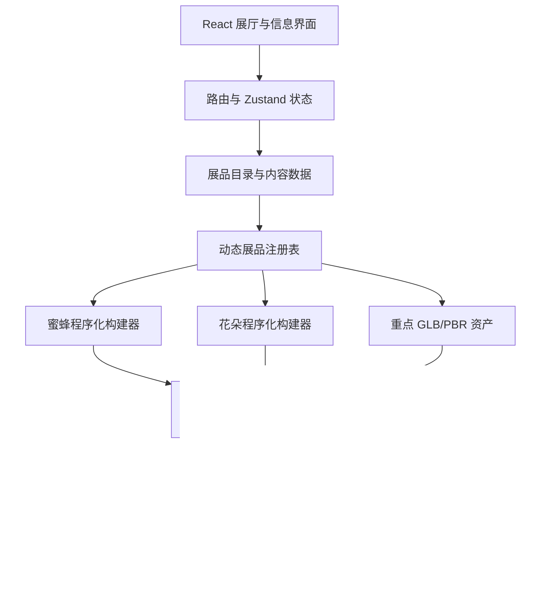

# 蜂之境线上蜜蜂科普博物馆前端技术方案

> 版本：V2.0  
> 更新日期：2026-08-21  
> 对应产品方案：`bee-product-master-plan.md`  
> 架构约束：纯前端、静态部署、桌面端与移动端兼容

## 1. 技术结论

继续使用现有的 **Vite + React + TypeScript + Three.js + React Three Fiber**，不推倒重来。

新版的技术重点从“搭建一个沉浸式单页场景”转为“建立可持续增加数字标本的博物馆系统”：

- 用程序化几何生成多数蜜蜂和花朵。
- 用统一展品协议连接镜头、热点、动作、比较和资源释放。
- 用结构化数据管理蜂种、职型、地域、季节、花朵、生命周期和来源。
- 对首页主展品和关键微距使用 GLB/PBR 精模，形成混合资产管线。
- 使用按需加载、缓存和设备降级，保证纯前端产品可在真实设备运行。

## 2. 技术栈分层

### 2.1 当前已安装并继续使用

| 层级 | 技术 | 用途 |
| --- | --- | --- |
| 构建 | Vite | 本地开发、代码分包、生产构建 |
| UI | React | 展厅页面、导航、说明面板、状态组合 |
| 语言 | TypeScript | 展品接口、数据模型和运行时边界 |
| 3D | Three.js | 几何体、材质、灯光、相机、动画和资源管理 |
| React 3D | `@react-three/fiber` | 把 Three.js 场景纳入 React 生命周期 |
| 3D 工具 | `@react-three/drei` | 控制器、环境光、加载辅助和常用组件 |

当前 `package.json` 已包含上述依赖，M0 阶段无需更换构建工具。

### 2.2 M0—M1 建议加入

| 技术 | 用途 | 是否必须 |
| --- | --- | --- |
| React Router | 展厅、展品和过程页路由 | 必须 |
| Zustand | 当前展品、观察模式、设置和轻量跨页状态 | 必须 |
| Zod | 静态 JSON/TS 数据的运行时校验 | 必须 |
| Vitest | 构建器、数据和资源管理单元测试 | 必须 |
| Testing Library | 普通 UI 和无障碍交互测试 | 建议 |
| Playwright | 展品打开、聚焦、切换、移动端流程测试 | 必须 |

这些依赖属于规划项，安装前应按阶段加入，不需要一开始安装全部后续工具。

### 2.3 M2 以后按需加入

| 技术 | 用途 | 启用条件 |
| --- | --- | --- |
| `@react-three/postprocessing` | 景深、辉光、色彩后期 | 主画面效果稳定后 |
| `three-stdlib` | Three.js 扩展工具 | 确有组件需求时 |
| glTF Transform | 离线压缩和检查 GLB | 首个精模资产进入项目时 |
| KTX2 | GPU 纹理压缩 | 纹理成为体积瓶颈时 |
| Draco / Meshopt | 网格压缩 | 精模传输体积超预算时 |

后期效果必须可按设备关闭。低端移动设备上优先保证结构可看和交互稳定，而不是保留所有视觉特效。

## 3. 总体架构



核心约束是：React 页面不直接了解每只蜜蜂的网格细节；页面只消费统一的展品协议和结构化内容。

## 4. 建议目录结构

```text
src/
  app/
    router.tsx
    store.ts
    settings.ts
  museum/
    entrance/
    world-bees/
    anatomy-castes/
    flowers-seasons/
    life-cycle/
    honey-workshop/
    compare/
  three/
    core/
      specimen.ts
      coordinates.ts
      dispose.ts
      quality.ts
    builders/
      loft.ts
      spindle.ts
      tube.ts
      petal.ts
      hair.ts
    bees/
      common/
      species/
      castes/
    flowers/
      common/
      species/
    motion/
    registry/
    scene/
    viewer/
  data/
    schemas/
    bees/
    flowers/
    relations/
    life-cycles/
    honey/
    sources/
  ui/
  styles/
```

目录按领域组织，不按“组件大杂烩”组织。一个新蜂种应主要通过新增参数和少量专用构建器完成，不应复制整套观察页面。

## 5. 3D 坐标与比例规范

所有程序化展品与 GLB 资产使用同一规则：

- `+X`：身体朝头部方向。
- `+Y`：向上。
- `+Z`：展品右侧。
- 内部单位：`1 = 1 cm`。
- 根节点原点：胸部几何中心或展品稳定旋转中心。
- 展品创建后必须计算 `Box3` 与包围球，不能依赖手写镜头距离。

统一坐标系能避免职型比较、热点定位和精模替换时反复修正。

## 6. 程序化展品协议

### 6.1 输出协议

```ts
export interface MuseumSpecimen {
  root: THREE.Group;
  anchors: Record<string, THREE.Object3D>;
  rig?: Record<string, THREE.Object3D>;
  bounds: THREE.Box3;
  metadata: {
    id: string;
    kind: 'bee' | 'flower' | 'stage';
    version: number;
  };
  dispose(): void;
}
```

禁止调用方通过 `root.children[3]` 之类的脆弱索引寻找器官。所有外部引用只能通过命名锚点、骨架节点或语义查询完成。

### 6.2 蜜蜂输入参数

```ts
export interface BeeBuildOptions {
  speciesId: string;
  caste?: 'worker' | 'queen' | 'drone';
  sex: 'female' | 'male';
  bodyLengthCm: number;
  proportions: BeeProportions;
  palette: BeePalette;
  hair: HairProfile;
  wings: WingProfile;
  legs: LegProfile;
  details: BeeDetailFlags;
  seed: number;
  quality: 'low' | 'medium' | 'high';
}
```

同一 `seed` 和配置必须生成相同展品，便于截图测试、问题复现和缓存。

### 6.3 花朵输入参数

```ts
export interface FlowerBuildOptions {
  speciesId: string;
  symmetry: 'radial' | 'bilateral';
  petalCount: number;
  corolla: CorollaProfile;
  inflorescence: InflorescenceProfile;
  bloom: number;
  palette: FlowerPalette;
  nectarAnchor: NectarAnchorProfile;
  seed: number;
  quality: 'low' | 'medium' | 'high';
}
```

## 7. 几何生成策略

### 7.1 蜜蜂

- 头、胸和腹：使用椭球、纺锤体或多截面放样；避免只靠简单球体拼接。
- 腹部条纹：优先让颜色跟随截面或使用共享材质参数，避免为每条纹创建大量独立网格。
- 足与触角：使用曲线管体或分节关节链，保留可动画节点。
- 翅：使用自定义二维轮廓生成薄面，翅脉采用合并线段或纹理；注意透明排序。
- 毛被：近景使用实例化短毛或壳层方案，中远景切换为法线/粗糙度表现。
- 花粉：使用 InstancedMesh 生成少量颗粒团，不为每粒花粉建立独立 React 组件。

### 7.2 花朵

- 花瓣：由中心线、宽度曲线和弯曲参数生成，再按对称规则复制。
- 花序：使用确定性分布器排列小花，适合槐花、薰衣草和向日葵等不同组织方式。
- 花蕊：优先实例化；微距视图再提高数量和几何复杂度。
- 风摆：在花朵根节点或花序骨架上做低频变形，不逐花瓣进行昂贵物理模拟。

### 7.3 精模资产

首页主展蜂、关键器官和叙事特写允许使用 Blender 制作的 GLB/PBR 模型，但必须：

- 遵循统一坐标与比例规范。
- 提供与程序化展品一致的命名锚点。
- 合并合理的材质和网格，避免过多 draw call。
- 在进入仓库前完成三角面、纹理尺寸、法线、动画和版权检查。
- 保留低中高三个等级或可用的简化版本。

## 8. 锚点、骨架和动作

### 8.1 标准锚点

蜜蜂至少提供：

```text
head, thorax, abdomen, compoundEyeL, compoundEyeR,
antennaL, antennaR, proboscis, foreWingL, foreWingR,
hindWingL, hindWingR, foreLegL, foreLegR,
midLegL, midLegR, hindLegL, hindLegR, sting
```

不适用的器官可以省略，但数据中必须说明原因。花朵至少提供 `flowerCenter`、`petalFocus`、`stamenFocus`、`nectarEntrance` 和 `stemBase`。

锚点必须满足两条硬性规则（工蜂标本开发中的实际回归教训）：

- 锚点应位于部件**表面**而非几何中心，否则热点遮挡检测会把锚点永远判为"被遮挡"，镜头聚焦也会钻进网格内部。
- 锚点存储**根节点缩放前的局部坐标**；若展品根节点带整体缩放，必须先算锚点、后应用缩放，否则锚点世界坐标被二次放大，镜头聚焦会飞出画面。

### 8.2 动作系统

- 基础状态：待机、触角试探、翅膀微调、梳理、行走、起飞、飞行、降落、访花。
- 使用轻量层级骨架和参数动作，不要求每个程序化标本都使用蒙皮网格。
- 动作通过状态机和混合时间切换，避免突然跳帧。
- 展品观察模式默认只播放低幅待机动作，用户聚焦器官时减弱动作幅度。

## 9. 标本观察器

观察器是所有展厅共享的核心组件，负责：

- 根据包围盒计算初始镜头、最小距离和最大距离。
- 将器官锚点投影到屏幕并处理遮挡、边缘吸附和背面淡出。
- 在自由旋转、器官聚焦、动作演示和比较模式之间切换。
- 保留用户“减少动态效果”设置。
- 在 WebGL 不可用或设备能力不足时展示海报图和完整文字内容。

镜头聚焦应使用目标点与距离的平滑插值；不得把镜头直接瞬移到硬编码坐标。

## 10. 展品注册、动态加载与缓存

### 10.1 注册表

按蜂种和花种拆分模块，用 Vite 的 `import.meta.glob` 建立动态注册表：

```ts
const beeModules = import.meta.glob('../bees/species/*.ts');
const flowerModules = import.meta.glob('../flowers/species/*.ts');
```

用户只下载当前展厅和当前展品需要的代码。首页不应打包所有物种的构建逻辑和高分辨率纹理。

### 10.2 缓存与释放

- 缓存最近使用的少量展品，建议从 3—5 个开始实测。
- 使用 LRU 策略移除最久未使用的展品。
- `dispose()` 必须释放几何体、独占材质、纹理、渲染目标和事件订阅。
- 共享材质与共享纹理通过引用计数管理，不能被单个展品提前释放。
- 自动化测试连续切换展品并检查内存与 WebGL 资源数量趋势。

## 11. 内容数据层

### 11.1 数据存储

首期使用仓库内的 TypeScript 或 JSON 数据，不建设后端 CMS。构建时用 Zod 校验，失败则阻止发布。

### 11.2 关系模型示例

```ts
interface BeeFlowerRelation {
  beeId: string;
  flowerId: string;
  regionId: string;
  season: 'spring' | 'summer' | 'autumn' | 'winter';
  relation: 'nectar' | 'pollen' | 'pollination' | 'observed-visit';
  evidence: 'primary' | 'review' | 'institutional' | 'editorial';
  sourceIds: string[];
  reviewStatus: 'draft' | 'reviewed' | 'verified';
}
```

UI 不允许忽略 `regionId` 和证据状态直接生成“某蜂最喜欢某花”的结论。

### 11.3 多语言准备

首期只发布中文，也应将内容字段与界面文案分离，保留中文名、学名、英文名等独立字段，为后续双语版本留出空间。

## 12. 路由与状态

### 12.1 建议路由

```text
/
/museum/world-bees
/museum/bees/:beeId
/museum/anatomy/:beeId
/museum/flowers
/museum/life-cycle/:storyId
/museum/honey-workshop
/compare?items=...
/sources
```

展品 ID 和比较项应体现在 URL 中，方便分享、刷新恢复和课堂投屏。

### 12.2 状态边界

- URL：当前展厅、展品、过程节点和可分享筛选项。
- Zustand：观察模式、当前热点、比较篮、画质和声音设置。
- 组件本地状态：面板开关、短暂动画和表单输入。
- `localStorage`：收藏、已参观记录和设备设置；必须带数据版本并可迁移。

## 13. 性能预算与降级

### 13.1 渲染策略

- 展品静止时使用按需渲染；动作播放时临时进入连续渲染。
- 使用 InstancedMesh、共享材质和合并几何降低 draw call。
- 根据设备像素比和性能采样限制渲染分辨率。
- 只有当前展厅保留 Canvas；路由离开后停止循环并释放资源。
- 纹理和 GLB 通过动态加载进入，不阻塞基本内容阅读。

### 13.2 初始性能预算

| 项目 | 桌面端目标 | 移动端目标 |
| --- | --- | --- |
| 单标本三角面 | 不高于约 150k | 不高于约 60k |
| 常态 draw call | 不高于约 120 | 不高于约 70 |
| 同屏高分辨率纹理 | 受显存监控约束 | 最长边优先不超过 2K |
| 交互帧率 | 接近 60 FPS | 稳定 30 FPS 以上 |
| 初始路由资源 | 不携带全馆资产 | 不携带全馆资产 |

预算是首轮基线，需在真实中端手机上测量后调整，不能只用开发电脑验收。

### 13.3 质量档位

- `high`：实例化绒毛、完整翅脉、后期景深、高分辨率阴影。
- `medium`：减少毛发与花粉实例、降低阴影和后期质量。
- `low`：材质替代毛发、关闭景深与实时阴影、简化动作。
- `fallback`：静态多角度图片 + 完整热点文字。

## 14. 无障碍与输入方式

- 所有关键操作支持鼠标、触摸和键盘。
- 3D 热点在 DOM 中有对应按钮和可读名称。
- 提供“减少动态效果”“关闭环境音”“高对比文本”选项。
- 重要知识不能只靠颜色、声音或 3D 空间位置表达。
- Canvas 之外保留展品摘要、器官列表和过程步骤，保证屏幕阅读器可访问。

## 15. 测试方案

### 15.1 单元测试

- 相同种子生成确定性结果。
- 所有必需锚点存在且位于合理包围盒范围。
- 蜂王、雄蜂和工蜂参数不会生成负尺寸或异常比例。
- 数据关系引用的蜂种、花朵、地域和来源均存在。
- `dispose()` 可重复调用且不会误释放共享资源。

### 15.2 集成与端到端测试

- 打开展品、旋转、缩放、聚焦器官、返回展厅。
- 连续切换多个展品，检查页面无崩溃和资源数量不持续上升。
- 桌面、触摸和键盘均可完成核心流程。
- 直接打开分享链接能恢复正确展品和比较项。
- WebGL 关闭时进入 fallback 内容。

### 15.3 视觉回归

固定相机、固定种子、固定灯光和固定画质，分别截取正面、侧面、背面和器官特写。视觉回归用于发现几何穿插、材质丢失、热点漂移和构图异常。

基线集必须至少包含一个**聚焦态**视角（如 `?focus=head&motion=0`）：只拍整体视角的基线无法捕捉镜头/锚点类回归（锚点缩放错误曾因此漏网）。镜头收敛后应吸附到精确终点，保证聚焦态画面可复现。容差按"最小想拦截的变化"标定，不可随手放宽。

## 16. 静态部署与发布

- 生产构建输出静态文件，可部署到 Cloudflare Pages、Vercel、Netlify 或 GitHub Pages。
- 需要配置 SPA 路由回退和带哈希的长期缓存。
- 大型 GLB、KTX2 和音频按内容哈希命名，并设置跨域与 MIME 类型。
- 发布前运行类型检查、数据校验、单元测试、端到端冒烟测试和资源预算检查。
- 来源页随版本发布，记录内容最后审校日期。

## 17. 分阶段实施顺序

### M0：基础重构

1. 引入路由、状态、数据校验和测试骨架。
2. 建立 `MuseumSpecimen`、坐标、锚点和资源释放协议。
3. 将现有蜜蜂原型包装成第一个标准展品。

### M1：西方蜜蜂工蜂垂直切片

1. 拆出头胸腹、翅、足、触角、毛被构建器。
2. 完成器官锚点、待机骨架和观察器。
3. 接入结构化说明、来源和移动端降级。
4. 建立确定性截图和资源释放测试。

### M2—M3：物种、职型与花朵工厂

1. 从参数扩展蜂王、雄蜂和其余 MVP 蜂种。
2. 建立花瓣、花蕊和花序生成器。
3. 完成比较台与地域季节关系浏览。

### M4—M6：过程展厅与发布

1. 生命周期状态机与时间轴。
2. 酿蜜步骤动画和蜂巢剖面。
3. 性能、无障碍、审校、fallback 和正式部署。

## 18. 当前进度与下一步

程序化建模地基已经完成。当前开发范围收敛为西方蜜蜂工蜂成品标本：模型从形态参数创建，统一输出根节点、包围盒、语义锚点、动作节点和幂等 `dispose()`；头胸腹连续放样、曲线肢体、口器、翅膜翅脉、程序化微表面与细线轮廓毛均由纯代码生成。蜂王和雄蜂参数代码保留，但暂停产品展示与继续扩展。

下一阶段优先完成：

- 固定相机视觉回归和工蜂器官微距截图。
- 连续打开、聚焦和资源释放测试。
- 为内容数据补齐来源、审校状态与独立器官条目。
- 完成工蜂成品质量验收后，再决定是否恢复职型或其他蜂种扩展。
