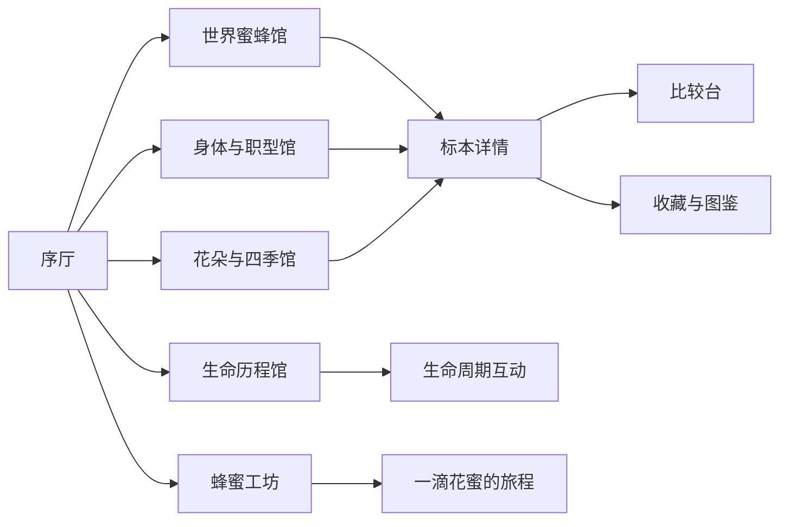

# 蜂之境：线上蜜蜂科普博物馆整体开发方案

> 版本：V2.0  
> 更新日期：2026-08-21  
> 产品形态：纯前端、可静态部署的沉浸式互动科普网站  
> 视觉方向：高级艺术化写实  
> 核心方法：程序化 3D 建模 + 精模资产混合

## 1. 版本结论

产品不再围绕“单条采蜜旅程”或“蜂花日历”展开，而是建设一个可以持续扩充的线上蜜蜂科普博物馆。

新版本以“蜜蜂本身”为绝对主角，借鉴 `insect-world` 用代码即时生成昆虫的思路，将蜜蜂身体、花朵结构、生命周期和酿蜜过程做成可观察、可拆解、可比较、可交互的数字展品。

核心价值由三个部分组成：

1. **像看真实标本一样观察蜜蜂**：旋转、缩放、聚焦器官、比较不同蜂种和不同职型。
2. **像走进生态现场一样理解关系**：了解蜂种、地域、季节和花朵之间的联系。
3. **像参与实验一样理解过程**：通过生命周期和酿蜜互动，把抽象知识变成可见的连续过程。

## 2. 产品定位与科学边界

### 2.1 产品定位

“蜂之境”是一座面向大众与青少年的互动式线上蜜蜂博物馆。它不是蜂蜜商城，也不是单纯的 3D 模型浏览器，而是由数字标本、生态场景、过程模拟和可信科普内容共同构成的学习产品。

### 2.2 内容原则

- 世界上存在大量不同类型的蜜蜂，首期不追求“收全”，而追求建立可扩充的分类与展品框架。
- “工蜂、蜂王、雄蜂”主要用于介绍具有社会性群体结构的蜜蜂，不能套用到所有蜂种；多数蜂类是独居或具有不同社会结构。
- 蜂花关系需要同时标注地域、季节和证据等级，避免把局部观察写成全球规律。
- “蜂蜜酿造”主要以蜜蜂属中的产蜜蜂为代表，不暗示所有蜜蜂都会储存可供人类采集的蜂蜜。
- 所有关键知识点保留来源、审校状态和最后复核日期。

## 3. 目标用户与使用场景

### 3.1 主要用户

- 10—18 岁学生：自然课、生物课、项目式学习。
- 亲子家庭：共同探索蜜蜂身体和生态关系。
- 自然爱好者：识别不同蜂种、地域与访花偏好。
- 教师和科普机构：课堂演示、活动导览、展览补充材料。

### 3.2 典型使用方式

- 3—5 分钟：观看一件“今日标本”或完成一段过程互动。
- 15—30 分钟：完整参观一个主题展厅。
- 课堂模式：全屏展示、分步骤讲解、快速切换展品。
- 自由探索：收藏展品、完成图鉴、比较不同蜜蜂。

## 4. 博物馆信息架构



### 4.1 序厅：第一次遇见蜜蜂

- 以一只程序化生成的主展蜂作为首屏视觉核心。
- 用户移动指针或轻触屏幕时，蜜蜂产生细微呼吸、触角试探和翅膀调整。
- 用最少的文字建立基本认知：蜜蜂不是单一物种，也不只有常见的黄黑条纹形象。
- 提供“自由参观”和“推荐路线”两种入口。

### 4.2 世界蜜蜂馆

- 通过地图、气候带和分类筛选进入不同蜂种。
- 每个蜂种以现场生成的 3D 数字标本呈现。
- 标本卡包含：中文名、学名、分类、分布、体型、社会结构、筑巢方式、典型访花与保护状态。
- 支持把两只或三只蜜蜂放到比较台，统一比例观察体型、颜色、毛被、足和口器差异。

### 4.3 身体与职型馆

- 讲解头、胸、腹、触角、复眼、单眼、翅、足、口器、螫针等结构。
- 热点必须固定在模型锚点上，而不是使用容易漂移的屏幕坐标。
- 对西方蜜蜂和东方蜜蜂提供工蜂、蜂王、雄蜂变体比较。
- 展示职型差异与群体分工，同时明确该体系不适用于所有蜂种。

### 4.4 花朵与四季馆

- 按地域与季节组织花朵，而不是只做通用花历。
- 花朵同样采用程序化建模：花瓣数量、花冠形态、花蕊排列、花序密度和颜色由参数生成。
- 通过“口器长度—花冠深度”“活动季节—花期”“地域重叠”等线索解释访花关系。
- 蜂花连线只表达“已记录或具有明确依据的关联”，不做绝对偏好判断。

### 4.5 生命历程馆

- 以卵、幼虫、蛹、成虫为基础阶段，构建可拖动的时间轴。
- 社会性蜜蜂增加蜂房、育幼、职型分化、出房、采集和死亡等分支。
- 独居蜂增加筑巢、储备花粉团、产卵、封巢、越冬和羽化等分支。
- 用户改变温度、食物或季节时，只展示经过科学审校的影响，不做未经验证的生命模拟。

### 4.6 蜂蜜工坊

- 以“一滴花蜜的旅程”为叙事主线：访花、吸取花蜜、蜜胃携带、归巢传递、酶参与、蒸发浓缩、封盖储存。
- 通过剖面蜂巢和粒子可视化，让含水量下降和花蜜转化过程可见。
- 独立介绍蜂王浆：来源、用途与蜂蜜的区别，不把它归入花蜜型蜂蜜。
- 后续可加入蜂蜡、花粉团和蜂胶等扩展内容。

## 5. 首期展品范围

### 5.1 MVP 蜜蜂

| 展品 | 选择原因 | 首期表现重点 |
| --- | --- | --- |
| 西方蜜蜂 `Apis mellifera` | 大众认知基础、便于讲职型与酿蜜 | 工蜂、蜂王、雄蜂三种变体 |
| 东方蜜蜂 `Apis cerana` | 与中国用户和亚洲生态关系密切 | 与西方蜜蜂比较 |
| 欧洲熊蜂 `Bombus terrestris` | 体型和毛被特征鲜明 | 毛发、振动授粉概念 |
| 壁蜂属代表 `Osmia` | 独居蜂代表 | 筑巢与花粉搬运 |
| 切叶蜂属代表 `Megachile` | 行为辨识度强 | 切叶筑巢与腹部集粉毛 |
| 木蜂属代表 `Xylocopa` | 大型蜂，视觉差异明显 | 金属光泽、木洞筑巢 |

后续扩展：大蜜蜂、小蜜蜂、无刺蜂、汗蜂、兰花蜂及不同地区代表种。

### 5.2 MVP 花朵

首期选择结构差异明显、地域信息较清楚且能支撑互动对比的花朵：

- 油菜花
- 槐花
- 向日葵
- 蓝莓花
- 三叶草
- 薰衣草

后续候选包括苹果花、荞麦花、椴树花、麦卢卡花、桉树花和兰花。此前方案中的女真树花蜜不再纳入范围。

### 5.3 MVP 地域切片

- 中国东部温带地区
- 中欧地区
- 北美温带地区

每个地域先做春、夏两个重点季节，秋冬以生命周期和越冬内容承接，避免首期场景数量失控。

## 6. 视觉与体验方向

### 6.1 高级艺术化写实

- 形态和关键结构可信，比例允许为可读性做轻微艺术化调整。
- 材质强调绒毛、甲壳、半透明翅膜、花粉颗粒和复眼层次。
- 背景使用低饱和环境色、局部光斑和景深，展品始终拥有最高视觉权重。
- 场景不追求照片式堆砌，而强调“自然史博物馆展陈 + 微距生态摄影”的组合感。

### 6.2 沉浸感来源

沉浸感主要来自可感知的响应，而不是依赖大量背景图片：

- 镜头靠近时逐步出现绒毛、花粉和翅脉细节。
- 用户聚焦器官时，镜头、灯光、标签和讲解同步变化。
- 蜜蜂飞行、停落、梳理、采集动作之间自然过渡。
- 环境声、振翅声和轻量触觉反馈可选，默认不自动播放高音量音频。

## 7. 程序化建模方案

### 7.1 可借鉴的核心思路

借鉴 `insect-world` 的不是具体外观，而是“以数据和代码生成展品”的生产方式：

- 用参数描述体节、轮廓、颜色、附肢、毛被和锚点。
- 用通用构建器生成几何体，再由物种配置形成差异。
- 每次打开展品时现场创建网格、材质、骨架和动作。
- 展品关闭后正确释放几何体、材质和纹理，防止内存不断增长。

### 7.2 统一展品输出契约

每只蜜蜂或每朵花都必须输出统一结构：

```ts
interface MuseumSpecimen {
  root: THREE.Group;
  anchors: Record<string, THREE.Object3D>;
  rig?: Record<string, THREE.Object3D>;
  bounds: THREE.Box3;
  dispose: () => void;
}
```

这样镜头聚焦、热点标注、动作系统、比较台和资源释放都不需要了解某个展品的内部实现。

### 7.3 蜜蜂构建器

通用组件包括：

- 头、胸、腹的纺锤体或截面放样体
- 复眼、单眼、触角、口器
- 三对足及足部特化结构
- 前翅、后翅和翅脉
- 毛被、条纹、金属光泽、花粉负载
- 工蜂、蜂王、雄蜂的体型与器官参数变体

### 7.4 花朵构建器

通用组件包括：

- 花瓣曲线与放样
- 辐射对称、两侧对称和蝶形花冠模板
- 花蕊、花萼、花托、花柄
- 总状、头状、穗状和伞形花序生成器
- 盛开程度、风摆、花粉量和花蜜入口锚点

### 7.5 混合资产策略

程序化建模负责物种覆盖、形态变体和即时交互；高质量 GLB/PBR 资产负责首页主展蜂、重点器官微距和叙事特写。两者使用相同的比例、锚点与材质规范，避免形成两个割裂的视觉系统。

## 8. 关键交互规则

### 8.1 标本观察器

- 拖动旋转，滚轮或双指缩放。
- 点击器官自动聚焦，第二次点击进入微距视图。
- 模型背面的标签淡出，避免文字穿过身体。
- 镜头不得进入模型内部；移动端保持更大的最小观察距离。
- “自由观察”和“讲解跟随”可随时切换。

### 8.2 比较台

- 统一真实比例与“等大观察”两种模式。
- 比较项包括体长、翼展、毛被、集粉结构、口器、社会结构和活动季节。
- 差异通过局部高亮和短句解释，不用满屏数值表替代观察。

### 8.3 过程互动

- 生命周期使用可拖动时间轴，不依赖长页面滚动。
- 酿蜜过程允许暂停、回退和单步查看。
- 每个过程节点都可以跳回相关器官、蜂种或花朵展品，形成知识网络。

## 9. 内容数据与审校

### 9.1 核心数据实体

- `BeeSpecies`：分类、形态、分布、社会结构、筑巢、季节、证据来源。
- `BeeCaste`：适用物种、职型、形态差异、行为和寿命范围。
- `FlowerSpecies`：花型、花期、地域、花蜜/花粉特征。
- `BeeFlowerRelation`：蜂种、花种、地域、季节、关系类型、证据等级。
- `LifeCycle`：物种或类型适用范围、阶段、时长范围和条件。
- `HoneyProcess`：步骤、参与器官、物质变化和解释层级。
- `SourceRecord`：标题、机构、链接、访问日期、审校人和状态。

### 9.2 审校状态

内容必须标记为 `draft`、`reviewed` 或 `verified`。正式展出的关键事实至少达到 `reviewed`；仍有争议或地区差异明显的内容应在界面中明确说明。

## 10. MVP 范围

### 10.1 必须完成

- 序厅及统一导航。
- 6 种程序化蜜蜂数字标本，其中西方蜜蜂包含三职型。
- 6 种程序化花朵。
- 世界蜜蜂馆、身体与职型馆、花朵与四季馆的可用首版。
- 一条社会性蜜蜂生命周期和一条独居蜂生命周期。
- 一条完整的“花蜜到蜂蜜”互动流程，并单独解释蜂王浆。
- 图鉴、比较台、来源页和基础无障碍支持。
- 桌面端与主流移动端可访问，可部署到静态托管平台。

### 10.2 首期不做

- 用户账号、云端存档和社区功能。
- 电商、蜂蜜购买或品牌导购。
- 开放世界自由飞行。
- 复杂生态数值模拟和多人联机。
- 一次性覆盖全球所有蜂种与全部地域。

## 11. 开发里程碑

| 阶段 | 目标 | 验收结果 |
| --- | --- | --- |
| M0 基础重构 | 建立新路由、数据模型、展品接口和目录结构 | 旧原型能力不丢失，能加载一个标准展品 |
| M1 数字标本垂直切片 | 完成西方蜜蜂工蜂及观察器 | 可旋转、聚焦器官、播放待机动作、移动端可用 |
| M2 物种工厂 | 扩展到 6 种蜂和三职型 | 可动态加载、比较和正确释放资源 |
| M3 程序化花朵与生态关系 | 完成 6 种花和地域季节筛选 | 蜂花关系有来源且可交互查看 |
| M4 生命历程馆 | 完成社会性与独居两条时间线 | 可拖动、暂停、跳转相关展品 |
| M5 蜂蜜工坊 | 完成一滴花蜜的旅程 | 过程完整、蜂蜜与蜂王浆概念清楚 |
| M6 品质与发布 | 性能、无障碍、内容审校和部署 | 满足预算并可公开访问 |

## 12. 现有原型迁移方案

### 12.1 保留

- Vite、React、TypeScript、Three.js、React Three Fiber 和 Drei 基础。
- 当前蜜蜂程序化几何、观察镜头、灯光和动作试验。
- 已确定的高级艺术化写实方向及 3D 评估文档。

### 12.2 重构

- 将单页 `App` 拆成展厅、展品观察器、数据层和通用 3D 基础设施。
- 将当前单只蜜蜂实现拆成“通用构建器 + 物种参数 + 职型参数”。
- 将页面上的硬编码文案迁移到带来源的结构化数据。
- 将热点、镜头和动作统一绑定到标准锚点与骨架接口。

### 12.3 作为历史资料保留

- 旧“蜂花历”和早期沉浸旅程 PRD 不再作为当前开发依据，但保留用于追溯产品演变。

## 13. 成功指标

- 60% 以上的新用户能在不看教程的情况下完成旋转、缩放和器官聚焦。
- 参观者完成一个主题展厅的中位时长达到 5 分钟以上。
- 重点页面移动端首屏可交互时间控制在可接受范围，弱设备能自动降级。
- 模型连续切换后无明显内存持续增长。
- 关键知识点来源覆盖率达到 100%，正式发布内容全部经过审校。
- 用户离开前平均查看至少 3 件展品或完成 1 个过程互动。

## 14. 当前开发进度

**M0 基础重构与 M1 西方蜜蜂数字标本垂直切片已经完成**，并在原工蜂目标上进一步扩展了蜂王和雄蜂。

当前已打通以下链路：

1. 结构化物种数据。
2. 程序化身体构建器。
3. 器官锚点和基础骨架。
4. 标本观察器与镜头聚焦。
5. 热点讲解和来源展示。
6. 资源释放、性能降级和移动端适配。

当前暂停进入 M2 和扩展新蜂种，优先把西方蜜蜂工蜂打磨为成品标本。工蜂需要先通过固定视角、器官微距、移动端、交互和资源释放验收，再决定何时恢复三职型比较及跨物种扩展。
