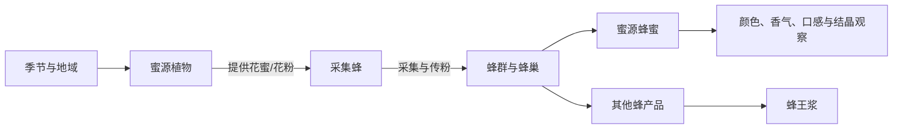

# 蜜蜂与蜜源生态科普网站 PRD（重构版）

> 产品暂定名：蜂花历 BeeBloom  
> 文档版本：V0.2  
> 更新日期：2026-08-11  
> 产品形态：纯前端响应式 Web 产品  
> 核心主题：看花开、跟蜂飞、懂蜂蜜  
> 对应旧版：[bee-website-prd.md](./bee-website-prd.md)

## 0. 本次重构结论

旧版以“3D 蜜蜂模型 + 身体热点 + 知识面板”为核心，信息结构和操作路径与 Anatomy 参考项目过于接近。新版不再把蜜蜂当作一个等待拆解的标本，而是把它放回四季、花田和蜂巢之中。

新版的核心体验是：

```text
发现一种正在开放的蜜源花
→ 跟随采集蜂完成一次采蜜
→ 看花蜜如何进入蜂巢并成为蜂蜜
→ 对比不同蜜源形成的蜂蜜
→ 进入蜂巢，分清蜂蜜、蜂王浆等蜂产品
→ 把知识收进自己的“蜂花手记”
```

3D 蜜蜂仍然存在，但从“整站中心”调整为旅程中的观察工具。产品真正的主角是“蜜蜂、植物、季节与蜂产品之间的关系”。

## 1. 产品定位

### 1.1 一句话定位

“蜂花历”是一款围绕蜜蜂、蜜源植物和蜂产品关系展开的沉浸式自然科普网站，用户通过四季花历、采蜜旅程、蜂蜜图鉴和蜂巢观察，理解“一朵花如何连接一只蜂与一滴蜜”。

### 1.2 产品价值

- 不只认识蜜蜂身体，还理解蜜蜂生活在怎样的生态关系中。
- 不只展示蜂蜜名称，还解释蜜源植物、采集过程和蜂蜜差异从何而来。
- 用可操作的故事代替百科目录，让知识沿着一次采蜜自然展开。
- 明确区分蜂蜜与蜂王浆、蜂花粉、蜂蜡等蜂产品，纠正常见误解。
- 通过本地可保存的“蜂花手记”形成探索动力，无需注册或后端服务。

### 1.3 核心口号

> 一朵花，一只蜂，一滴蜜的旅程。

### 1.4 产品边界

本产品是自然与食品来源科普，不是蜂蜜商城、养蜂生产软件、营养诊疗工具或医疗建议平台。

## 2. 与参考项目的关系

### 2.1 可以借鉴的能力

- 3D 模型的渐进加载、旋转缩放、移动端降级和资源压缩方案。
- 热点标注与镜头聚焦的基础实现。
- 科普内容与模型坐标分离的数据结构。
- 多语言、无障碍、键盘操作和“减少动态效果”支持。
- 一个主题下延伸图文、比较和测验内容的组织经验。

### 2.2 明确不沿用的设计

| 参考项目模式 | 新版处理方式 |
| --- | --- |
| 单个 3D 对象占据首屏中心 | 首屏展示会随季节变化的蜜源景观，蜜蜂只是引导角色 |
| 左侧对象列表、中央模型、右侧信息板 | 改为全景探索、章节式叙事和底部手记卡片 |
| 点击部位后阅读器官知识 | 用户在花朵、飞行、蜂巢和蜂产品之间完成任务 |
| 对象之间是平行百科条目 | 内容由“花期—采集—酿蜜—产品”关系网络串联 |
| 测验是独立按钮 | 问题嵌入旅程节点，完成后形成个人观察记录 |
| 医学标本室视觉 | 改为植物志、田野笔记与蜂蜜实验台的视觉语言 |

## 3. 目标与非目标

### 3.1 首期目标

- 建立一条 5～8 分钟可完成的“一滴蜜的旅程”。
- 首发包含槐花蜜、油菜花蜜 2 个蜜源蜂蜜专题。
- 首发包含蜂王浆专题，并清楚说明它不是蜂蜜。
- 提供蜜蜂基础知识，但不让解剖内容占据主要浏览路径。
- 支持用户按季节、植物或蜂产品三种方式发现内容。
- 全部核心内容在无登录、无后端条件下可访问。
- 桌面端强调沉浸体验，移动端保证完整阅读与轻量互动。

### 3.2 首期非目标

- 不做购买、价格比较、品牌推荐和商家入驻。
- 不做真实蜂场经营、蜂箱监测或病虫害诊断。
- 不承诺基于用户定位给出精确花期或产蜜预测。
- 不把风味描述、颜色和结晶表现写成绝对结论。
- 不宣传蜂蜜或蜂王浆的治疗功效。
- 不要求为每种植物、蜜蜂角色分别制作高精度 3D 模型。
- 不做账号、评论、排行榜和云端收藏。

## 4. 目标用户

### 4.1 核心用户

#### 亲子家庭与学生

- 年龄建议：9 岁以上。
- 想知道蜂蜜从哪里来、蜜蜂如何采蜜，以及不同蜂蜜为什么不同。
- 偏好直观、短段落、可操作的内容。

#### 自然与园艺爱好者

- 对花期、传粉昆虫、蜜源植物和城市生态感兴趣。
- 希望建立“植物—蜜蜂—蜂蜜”的关联认识。

#### 蜂蜜消费者

- 见过“槐花蜜”“油菜花蜜”等名称，但不了解命名和来源。
- 需要非营销化、可追溯资料来源的基础知识。

### 4.2 次级用户

- 中小学自然教育教师。
- 科技馆、自然博物馆和研学机构。
- 养蜂入门者与自然观察社团。

## 5. 核心概念模型

产品围绕四类对象建立关系，而不是建立一组彼此孤立的页面。



用户可以从任何对象进入，但页面都应提供下一段关系，而不是让用户读完一张卡片后无处可去。

## 6. 信息架构

### 6.1 顶部导航

- 今日花开：首页与季节入口。
- 寻蜜地图：蜜源植物与花期探索。
- 一滴蜜的旅程：核心互动叙事。
- 蜂蜜图鉴：蜜源蜂蜜浏览与比较。
- 蜂巢里面：蜂群、酿蜜与蜂产品。
- 蜂花手记：本地收藏、观察记录和知识进度。

移动端底部只保留：首页、地图、旅程、图鉴、手记。蜂巢内容从旅程和图鉴进入。

### 6.2 内容树

```text
今日花开
├── 当前季节景观
├── 本季蜜源植物
├── 跟随一只采集蜂
└── 今日知识卡

寻蜜地图
├── 春／夏／秋／冬花历
├── 植物卡片
│   ├── 槐／刺槐（首期）
│   └── 油菜（首期）
└── 地域与花期说明

一滴蜜的旅程
├── 找到花朵
├── 采集花蜜
├── 同伴接力
├── 水分减少与成熟
├── 蜂房封盖
└── 认识这滴蜜

蜂蜜图鉴
├── 槐花蜜
├── 油菜花蜜
├── 两两比较
└── 如何读懂蜜源名称

蜂巢里面
├── 工蜂的一天
├── 蜂王、工蜂与雄蜂
├── 蜂蜜从哪里来
├── 蜂王浆从哪里来
└── 蜂蜜／蜂王浆／蜂花粉／蜂蜡概念对比

蜂花手记
├── 已发现的花
├── 已认识的蜂蜜
├── 旅程徽记
└── 重新探索
```

## 7. 核心体验设计

### 7.1 首页：今日花开

#### 设计目标

首页不展示悬空旋转的蜜蜂标本，而是一处会随季节改变的“蜜源窗口”。用户先看见花与环境，再发现正在工作的蜜蜂。

#### 首屏构成

- 全屏或宽幅的 2.5D 蜜源景观。
- 一只缓慢飞行的采集蜂作为视线引导，不自动播放长动画。
- 主标题：“今天，蜜蜂会飞向哪朵花？”
- 主行动：“跟它出发”。
- 次行动：“打开四季花历”。
- 当前场景标签：季节、代表植物、内容为示意还是已核实地区资料。

#### 交互

- 指针移动或手机轻扫只产生轻微景深，不控制复杂镜头。
- 点击花朵弹出一张简短观察卡；点击蜜蜂进入采蜜旅程。
- 拖动季节刻度，场景颜色、开花植物和环境声氛围同步变化。
- 系统开启“减少动态效果”时，场景切换为静态分层插画。

### 7.2 寻蜜地图：四季花历

#### 设计目标

让用户理解“蜜源不是一个商品标签，而是一种植物在特定时间和环境中与蜜蜂发生的关系”。

#### 页面形态

采用“季节轮 + 风景带”，而不是行政区精确地图。首期的地理信息只做经审核的概括，避免在没有实时数据时制造精确感。

#### 核心操作

- 拖动季节轮查看不同月份的代表蜜源。
- 按植物形态、季节或蜜源蜂蜜筛选。
- 选择植物后展开“花朵档案”：植物名称、学名、典型花期、花蜜与花粉、常见生境、访花观察、关联蜂蜜。
- 点击“跟蜂去看看”，把所选植物带入“一滴蜜的旅程”。
- 将植物加入蜂花手记。

#### 信息谨慎项

- 花期必须标注“因纬度、海拔、天气和品种而异”。
- “单花蜜／蜜源蜂蜜”表达为主要或优势蜜源，不暗示每一滴都来自同一种花。
- 地理分布、泌蜜条件和商品名称必须保留资料来源。

### 7.3 一滴蜜的旅程

这是首期最重要的体验，不是知识文章，也不是自由飞行游戏，而是可探索的互动叙事。

#### 章节一：发现花朵

- 用户从 2 种首发植物中选择一种。
- 花朵以局部放大方式出现，可观察花冠、花药和蜜腺相关位置。
- 系统提出一个微任务，例如寻找可能吸引访花昆虫的区域。

#### 章节二：采集花蜜

- 用户拖动采集蜂靠近花朵，动作容错较高。
- 花蜜量以抽象计量呈现，不模拟真实生产数据。
- 花粉在蜂体表附着，顺带解释授粉，但不把花蜜和花粉混为一物。

#### 章节三：返回蜂巢

- 用一段短路线展示飞行消耗、方向记忆与群体协作。
- 用户不需要操纵复杂飞行，只需在两个路线节点做选择。

#### 章节四：蜂巢接力

- 画面从花田切换为蜂巢剖面插画。
- 用户把采集蜂带回的内容交给巢内工蜂。
- 通过动效说明处理、转移、减少水分和储存的过程，避免用“蜂蜜就是蜂吐出来的”作为主叙述。

#### 章节五：成熟与封盖

- 用户拖动时间刻度，观察蜂房状态变化。
- 完成后生成一张“本次旅程卡”：蜜源植物、关键步骤和相关蜜种入口。

#### 章节六：分岔问题

结尾提出：“蜂王浆也走过同一条路线吗？”用户选择后进入蜂巢产品对比。正确结论是蜂王浆不是某种花蜜蜂蜜，而是由年轻工蜂相关腺体分泌、用于哺育幼虫和蜂王的蜂产品。

### 7.4 蜂蜜图鉴

#### 设计目标

建立一个有科学边界的感官观察工具，不做商品评分或“越贵越好”的排行。

#### 图鉴主页

蜂蜜以半透明玻璃样品卡呈现，卡片颜色只能作为编辑后的代表视觉，必须提示天然产品会因来源、地区、年份和批次而变化。

每张卡显示：

- 蜂蜜名称与对应蜜源植物。
- 植物学名称和别名。
- 代表花期与常见产区说明。
- 颜色、香气、甜感、余味和结晶倾向的定性描述。
- “这些特征为什么会不同”的解释。
- 资料来源与审核状态。

#### 对比实验台

- 一次选择 2 种，不允许无限横向堆叠。
- 对比维度：植物来源、花期、代表颜色、香气描述、结晶观察、故事标签。
- 同一批信息使用共同刻度，禁止用伪精确数值制造科学感。
- 对比结尾提供“去看它的花”和“跟随采集旅程”。

### 7.5 蜂巢里面

#### 页面定位

这是一个蜂群工作现场，不是第二个解剖页面。页面采用蜂巢剖面插画或轻量 3D 场景，用户通过工作区域认识角色和产品。

#### 互动区域

- 巢门：采集蜂返回与守卫行为。
- 储蜜区：花蜜处理、储存与封盖。
- 育幼区：幼虫照料与蜂王浆。
- 花粉储存区：花粉与蜂粮概念。
- 蜂王活动区：蜂王角色，不渲染等级或人格化统治。

#### 产品来源对比

| 对象 | 分类 | 来源主线 | 用户必须带走的结论 |
| --- | --- | --- | --- |
| 蜂蜜 | 蜂产品／食品 | 蜜蜂采集花蜜或蜜露并在蜂巢中加工成熟 | 蜜源植物会影响蜂蜜特征，但不是绝对单一来源 |
| 蜂王浆 | 蜂产品 | 年轻工蜂相关腺体的分泌物 | 蜂王浆不是蜂蜜，也不是某一种花能直接产出的“蜜” |
| 蜂花粉 | 扩展内容 | 工蜂采集并携带的花粉团 | 花粉与花蜜是不同物质 |
| 蜂蜡 | 扩展内容 | 工蜂蜡腺分泌并用于构筑巢房 | 蜂蜡不是植物直接提供的材料 |

### 7.6 蜜蜂观察站

蜜蜂身体知识降级为二级模块，并改用“完成任务需要哪些工具”的叙述。

围绕任务组织：

- 找花：复眼、单眼和触角。
- 取食：口器。
- 飞行：前翅、后翅与飞行肌相关概念。
- 携粉：体毛、足和花粉筐。
- 沟通：气味、触碰和舞蹈相关概念。
- 防御：螫针及使用者差异。

3D 模型只在用户点击“仔细看看这只采集蜂”后加载。默认页面使用快速插画，避免首屏因大模型等待。

### 7.7 蜂花手记

#### 作用

用收藏和完成感代替传统的章节目录与独立考试。

#### 内容

- 已发现植物剪影，发现后变为彩色。
- 已完成的蜜源旅程。
- 已读蜂蜜卡和蜂产品卡。
- 旅程中的关键问答结果。
- 一键清除本地记录。

所有数据仅保存在浏览器本地，并明确提示清除浏览器数据后可能丢失。

## 8. 首发内容矩阵

| 专题 | 产品分类 | 首期叙事角度 | 代表性交互 | 内容风险提示 |
| --- | --- | --- | --- | --- |
| 槐花蜜／洋槐蜜 | 蜜源蜂蜜 | 花期短窗口、采集路线与植物来源 | 花期场景切换、跟随采集蜂 | “槐花”商品名与具体植物来源需核实 |
| 油菜花蜜 | 蜜源蜂蜜 | 农田景观、作物与传粉关系 | 大面积花田路线、结晶观察卡 | 花期和感官特征存在地域与批次差异 |
| 蜂王浆 | 其他蜂产品 | 育幼区、工蜂分泌与蜂王食物 | 在蜂巢中对比两条来源路径 | 不得归为花蜜蜂蜜，不做保健疗效宣传 |

每个蜜源蜂蜜专题统一包含 6 个内容章节：

1. 先认识花。
2. 什么时候可能遇见它。
3. 蜜蜂如何访问它。
4. 从花到蜂巢发生了什么。
5. 蜂蜜可以观察哪些特征。
6. 哪些说法需要谨慎。

## 9. 内容数据模型

### 9.1 蜜源植物

```yaml
id: robinia
commonName: 待审核中文名
scientificName: 待审核学名
aliases: []
floweringWindow:
  label: 因地区而异
  startMonth: null
  endMonth: null
regions: []
habitats: []
nectarNotes: ""
pollenNotes: ""
beeVisitNotes: ""
relatedHoneyIds: []
sources: []
reviewStatus: draft
```

### 9.2 蜜源蜂蜜

```yaml
id: acacia-honey
name: 槐花蜜／洋槐蜜（名称待审核）
category: floral-honey
primaryPlantIds: []
sensoryProfile:
  color: { label: "", variabilityNote: "" }
  aroma: []
  sweetness: ""
  finish: []
crystallization:
  tendencyLabel: ""
  variabilityNote: ""
storySteps: []
sources: []
reviewStatus: draft
```

### 9.3 其他蜂产品

```yaml
id: royal-jelly
name: 蜂王浆
category: bee-secretion
madeBy: 年轻工蜂
productionArea: 育幼区
usedFor: 幼虫与蜂王营养
notTheSameAs: [蜂蜜, 花蜜, 蜂花粉]
healthClaimsPolicy: 禁止未经充分证据支持的疗效表述
sources: []
reviewStatus: draft
```

## 10. 关键用户路径

### 10.1 首次访问：故事路径

```text
首页季节景观
→ 点击“跟它出发”
→ 选择一种花
→ 完成采集、返巢和成熟步骤
→ 解锁对应蜂蜜卡
→ 回答蜂王浆分岔问题
→ 收藏到蜂花手记
```

### 10.2 带着问题来：查询路径

```text
进入蜂蜜图鉴
→ 搜索“槐花蜜”
→ 查看植物来源与特征边界
→ 与油菜花蜜比较
→ 跳转对应植物和旅程
```

### 10.3 课堂展示：演示路径

```text
选择“一滴蜜的旅程”演示模式
→ 系统按章节播放
→ 教师在关键节点暂停提问
→ 打开蜂蜜与蜂王浆来源对比
→ 生成本节知识回顾
```

## 11. 视觉设计方向

### 11.1 视觉概念

关键词：植物志、田野笔记、蜂蜜透光感、自然观察、温暖但克制。

避免：

- 医疗仪器面板、暗色实验室和标本陈列感。
- 大面积黄黑警示条纹。
- 满屏六边形蜂巢装饰。
- 过度卡通化的拟人蜜蜂。
- 把所有蜂蜜都画成同一种金黄色。

### 11.2 色彩系统

基础颜色以植物与纸张为主，花种颜色只作为章节主题色。

| 角色 | 建议色 | 用途 |
| --- | --- | --- |
| 纸张白 | `#F7F3E8` | 主背景 |
| 林下绿 | `#314A3A` | 导航、正文强调 |
| 蜂蜜琥珀 | `#C98224` | 核心行动与旅程节点 |
| 花粉黄 | `#E9B949` | 提示与发现状态 |
| 槐花白绿 | `#DDE8D3` | 槐花专题 |
| 油菜花黄 | `#F2CC45` | 油菜专题 |
| 蜂王浆乳白 | `#EEE4C8` | 蜂王浆专题 |

### 11.3 图形语言

- 植物使用科学插画与纸张剪影结合的方式。
- 蜂蜜样品使用半透明色层，不把颜色当成鉴真依据。
- 蜂巢以剖面叙事插画为主，必要时叠加轻量粒子和路径动画。
- 图标采用线描植物观察风格，不沿用医学器官图标体系。

### 11.4 动效原则

- 动效必须表达季节变化、飞行路径、花粉转移或蜂巢接力等含义。
- 单段关键动画控制在 3～8 秒，可暂停、跳过和重播。
- 不用持续自动旋转制造“高级感”。
- 移动端和低性能设备默认减少粒子、景深和实时阴影。

## 12. 3D 与媒体策略

### 12.1 资产分层

| 内容 | 首期表现方式 | 原因 |
| --- | --- | --- |
| 采集蜂外形 | 1 个优化后的 3D 模型 | 支持任务式观察与镜头特写 |
| 花朵与花田 | 分层插画、局部 3D 或精灵图 | 更容易建立独特艺术风格并控制性能 |
| 蜂巢内部 | 2.5D 剖面插画 | 更适合表达多角色协作和产品来源 |
| 蜂蜜样品 | CSS／WebGL 材质效果 | 无需为每种蜂蜜制作独立模型 |
| 花粉与花蜜流动 | 轻量粒子或路径动画 | 强化过程，不追求物理仿真 |

### 12.2 3D 蜜蜂使用规则

- 不在页面加载时自动下载，用户进入旅程或观察站后再加载。
- 不把所有身体部位都做成常驻热点。
- 镜头由任务触发，例如“看看花粉筐”，而不是让用户在无目标状态下寻找小点。
- 提供静态多角度插画作为失败和低性能降级方案。

## 13. 交互规范

### 13.1 发现式反馈

- 未发现对象使用轮廓，不用锁图标制造挫败感。
- 发现新植物时以压花进入手记的动效反馈。
- 完成旅程后奖励新内容，不用积分排行榜。

### 13.2 微任务规范

- 每个任务只包含一个目标。
- 10 秒内应能理解如何操作。
- 连续两次操作失败后自动显示提示。
- 所有拖拽交互必须提供点击替代方案。

### 13.3 比较规范

- 默认两两比较。
- 感官描述用相同维度和同一套定性词表。
- 数据不足时显示“待补充／因产地而异”，不填造精确值。

## 14. 响应式与无障碍

### 14.1 桌面端

- 优先宽度：1280～1600 px。
- 保留全景、季节拖动和横向旅程。
- 详情以可关闭的下方手记层出现，不使用固定右侧信息栏。

### 14.2 移动端

- 全景改为纵向章节卡与轻量视差。
- 横向季节轮提供可点击月份列表替代。
- 旅程任务扩大触控区域，避免精细拖拽。
- 蜂蜜对比改为上下对照。

### 14.3 无障碍

- 所有核心交互可用键盘完成。
- 插画、图表和 3D 模型提供文本等价内容。
- 颜色之外同时使用文字、形状和图案表达状态。
- 支持 `prefers-reduced-motion`。
- 正文对比度达到 WCAG AA 目标。

## 15. 内容与科学审核

### 15.1 基本规则

- 每个植物、过程和产品的关键事实记录来源、发布日期与审核状态。
- 植物必须同时保存中文名、学名、别名与具体资料来源。
- 将“常见”“典型”“可能”与确定事实区分开。
- 感官描述和结晶表现必须提示自然差异，不能作为真伪鉴定结论。
- 不使用“排毒”“治愈”“抗癌”等未经产品语境下充分支持的健康宣传。
- 儿童内容避免鼓励接近或触碰真实蜂群。

### 15.2 首期必须解释的概念

- 蜜蜂访问花朵可能同时涉及花蜜采集与花粉携带，但二者不是同一物质。
- 蜜源蜂蜜通常表示主要或优势植物来源，不等于绝对 100% 单一花源。
- 蜂蜜特征会受到植物来源、地域、季节、气候和处理方式等因素影响。
- 蜂王浆是工蜂分泌并用于育幼的蜂产品，不属于蜜源蜂蜜。

### 15.3 建议资料基线

- 单花蜜与植物来源综述：[Volatile Compounds in Honey](https://pmc.ncbi.nlm.nih.gov/articles/PMC3257144/)
- 不同单花蜜特性综述：[Monofloral Honeys as a Potential Source of Natural Antioxidants, Minerals and Medicine](https://pmc.ncbi.nlm.nih.gov/articles/PMC8300703/)
- 蜂王浆来源与组成综述：[Health Promoting Properties of Bee Royal Jelly](https://pmc.ncbi.nlm.nih.gov/articles/PMC7915653/)

上线前仍需为每个具体蜜源植物补充权威植物志、农业或养蜂资料，不以以上综述代替本地物种核验。

## 16. 纯前端产品约束

- 科普内容、来源与交互配置以本地 JSON／TypeScript 数据文件维护。
- 蜂花手记保存在 `localStorage`，并提供导出和清除入口。
- 搜索使用本地索引，不依赖云端搜索服务。
- 花期按编辑内容展示，不请求实时天气和定位。
- 首屏不加载 3D 模型、高清视频或全部图鉴图片。
- 静态部署后所有核心页面可通过固定 URL 直接访问与分享。

## 17. 功能优先级

### P0：首期必须完成

- 今日花开首页与季节切换。
- 一滴蜜的旅程完整 6 章节。
- 槐花蜜、油菜花蜜专题框架。
- 蜂王浆来源专题与蜂蜜对比。
- 蜂蜜图鉴和两两比较。
- 蜂巢 2.5D 互动场景。
- 蜜蜂观察站的 1 个采集蜂模型或静态降级版本。
- 蜂花手记本地保存。
- 资料来源、免责声明和审核状态显示。
- 移动端、键盘操作与减少动态效果支持。

### P1：体验增强

- 地区版花历。
- 更多蜜源植物与蜂蜜专题。
- 课堂演示模式。
- 蜂蜜颜色与结晶过程的可视化实验。
- 手记导出为图片或 PDF。
- 中英文切换。

### P2：长期方向

- 真实蜂场或植物园合作内容。
- 经审核的地区花期数据集。
- 城市传粉观察路线。
- 多种蜂类与蜜蜂以外传粉昆虫专题。
- PWA 离线访问。

## 18. 验收标准

### 18.1 产品差异化

- 首页不采用“左侧对象列表—中央 3D—右侧知识板”布局。
- 用户无需操作 3D 模型即可完成主要科普旅程。
- 至少 70% 的首期核心页面以生态关系或过程为主要内容，而非身体结构。
- 每个蜂蜜专题都能跳转到植物、采集过程和蜂巢三个关联内容。

### 18.2 内容完整性

- 2 种蜜源蜂蜜均具备统一的 6 章内容结构。
- 蜂王浆页面明确出现“不是蜂蜜”的概念说明。
- 关键事实均能展开查看来源。
- 花期、地域、颜色和感官描述均包含差异说明。

### 18.3 体验完成度

- 首次访问用户可在 8 分钟内完成一次完整旅程。
- 用户在 3 次操作内能从任一蜂蜜到达对应植物页面。
- 旅程中的交互均有键盘和点击替代方案。
- 关闭 WebGL 或模型加载失败时，内容仍可完整阅读。

### 18.4 性能目标

- 首屏不依赖 3D 模型完成可见内容渲染。
- 首屏关键资源建议控制在 1.5 MB 内。
- 单个 3D 蜜蜂模型压缩后建议控制在 5 MB 内。
- 移动端默认关闭高成本景深、实时阴影和大量粒子。

## 19. 成功指标

纯前端首期重点观察匿名事件，不收集不必要的个人数据。

- “跟它出发”点击率。
- 一滴蜜旅程完成率。
- 蜜源植物到蜂蜜图鉴的跨模块访问率。
- 蜂蜜图鉴两两比较使用率。
- 蜂王浆来源问题答对率及查看解释率。
- 蜂花手记至少收藏 1 个对象的用户比例。
- 移动端模型降级率和旅程退出节点。

## 20. 风险与应对

| 风险 | 影响 | 应对 |
| --- | --- | --- |
| 蜜源名称存在俗名、商品名和植物学名称混用 | 科学错误与信任受损 | 建立别名字段，上线前由植物与养蜂专业人员审核 |
| 花期和蜂蜜特征被写成绝对值 | 用户误解 | 强制差异说明字段，禁止无来源的精确数值 |
| 蜂王浆被包装成保健宣传 | 偏离科普定位 | 只讲来源、用途与概念，不做疗效承诺 |
| 互动过重导致移动端卡顿 | 跳出率上升 | 首屏 2.5D、按需加载 3D、静态降级 |
| 内容扩展后图鉴变成卡片仓库 | 失去故事主线 | 每个对象必须接入至少两条关系路径 |
| 视觉仍被黄色和蜂巢六边形绑架 | 品牌同质化 | 以植物志与季节色为主，蜂蜜色只做局部强调 |

## 21. 建议实施阶段

### 阶段一：内容定标与低保真原型

- 核实 2 种蜜源植物的准确名称、物种、花期和蜂蜜内容。
- 完成蜂王浆与蜂蜜的概念边界审核。
- 先用灰度原型验证首页、旅程和图鉴之间是否能顺畅跳转。

### 阶段二：视觉样片

- 制作 1 个季节首页场景。
- 制作 1 种植物、1 种蜂蜜和蜂王浆的完整视觉样片。
- 确定植物志、蜂蜜材质与蜂巢剖面的统一艺术风格。

### 阶段三：核心开发

- 完成一滴蜜旅程、季节轮、图鉴对比和蜂花手记。
- 接入按需加载的 3D 蜜蜂与静态降级。
- 建立内容数据结构和来源展示组件。

### 阶段四：扩充与验证

- 完成槐花蜜、油菜花蜜 2 个完整专题。
- 邀请目标用户完成 5～8 分钟任务测试。
- 进行科学审核、无障碍测试和移动端性能测试。

## 22. 首期成功定义

首期成功不是做出一个“把人体器官换成蜜蜂”的 3D 网站，而是让用户在一次有起点、有过程、有结果的探索中，真正理解：

1. 蜜蜂与花朵之间不仅是取蜜关系，也包含传粉关系。
2. 不同蜜源蜂蜜的差异从植物与环境开始形成。
3. 蜂蜜在蜂巢中经过群体协作而成熟。
4. 蜂王浆虽然也是蜂产品，但来源与蜂蜜不同。
5. 一只蜜蜂的身体结构，是它完成生态任务的工具，而不是产品的全部内容。
